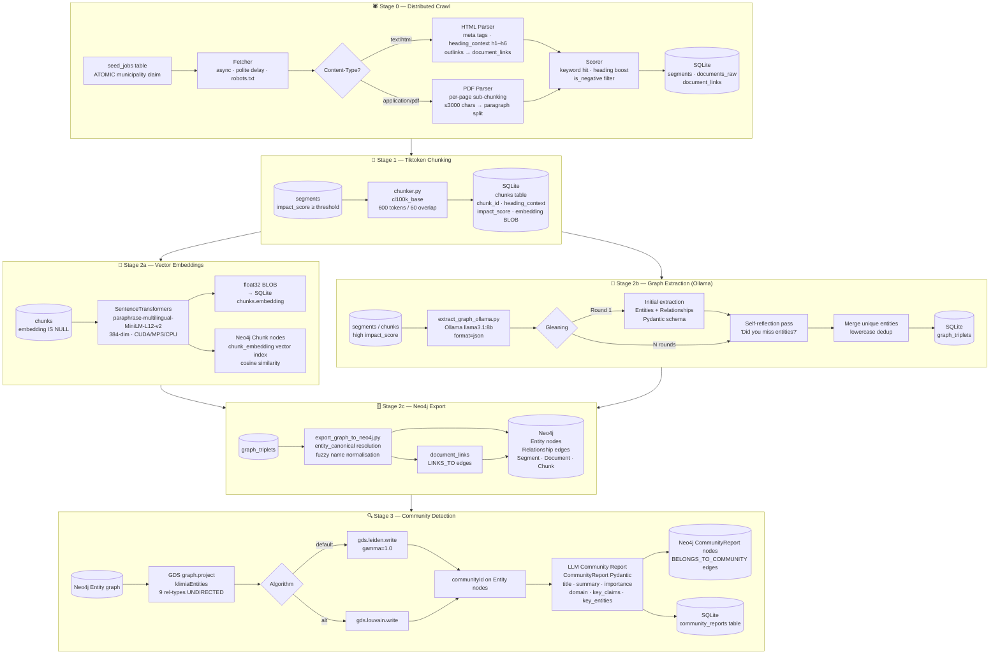
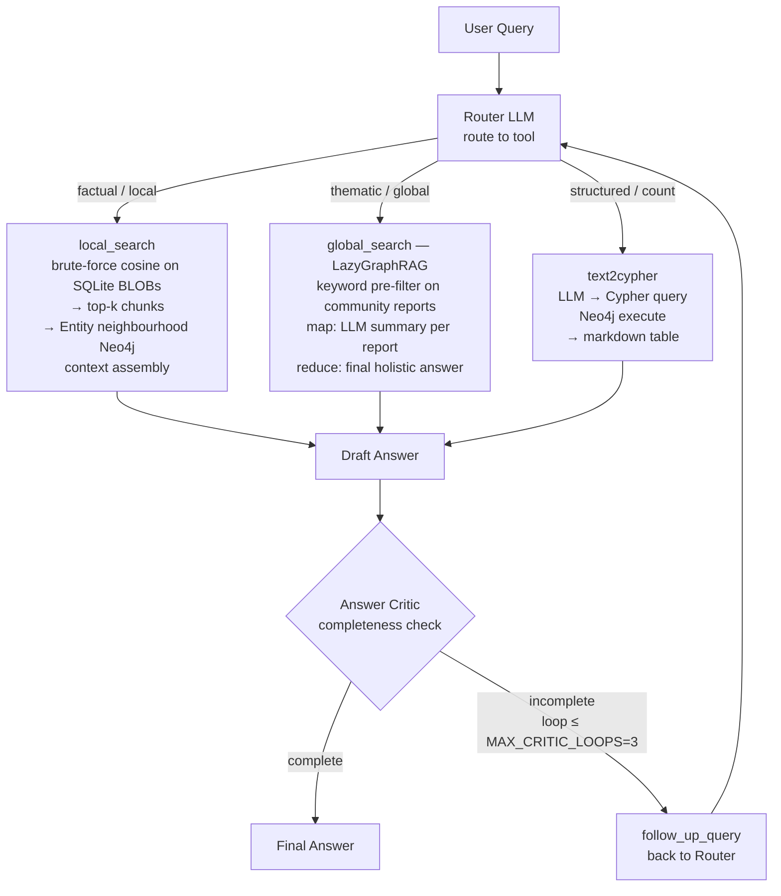
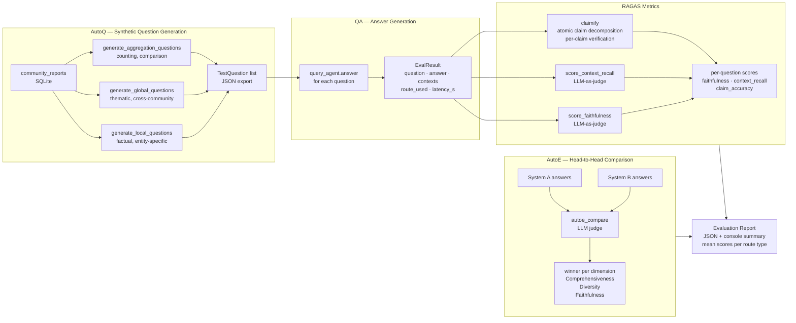
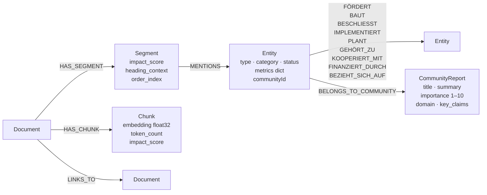

# KIT KlimaCrawler — GraphRAG Pipeline Diagrams

Visual overview of the full index-time and query-time flows.

---

## 1. Index-Time Pipeline (Data Ingestion → Graph Construction)



---

## 2. Query-Time Pipeline (Multi-Agent Retrieval)



---

## 3. Evaluation Pipeline (Stage 5)



---

## 4. Data Model (Neo4j Graph Schema)



---

## 5. Running the Full Pipeline

```bash
# 0. Crawl municipalities (distributed)
python -m crawler.scripts.init_seed_jobs
python -m crawler.scripts.run_worker

# 1. Tiktoken chunking
python -m crawler.scripts.chunk_documents --chunk-size 600 --overlap 60 --min-score 15

# 2a. Generate embeddings (local GPU)
python -m crawler.scripts.generate_embeddings --model paraphrase-multilingual-MiniLM-L12-v2 --neo4j

# 2b. Extract entity graph (Ollama, privacy-compliant)
python -m crawler.scripts.extract_graph_ollama --model llama3.1:8b --gleaning 1 --chunk-mode

# 2c. Export to Neo4j
python -m crawler.scripts.export_graph_to_neo4j

# 3. Community detection + LLM reports
python -m crawler.scripts.detect_communities --algorithm leiden --min-size 3

# 4. Interactive query (multi-agent)
python -m crawler.scripts.query_agent --interactive

# 5. Scientific evaluation
python -m crawler.scripts.evaluate --questions 30 --output eval_results.json

# Utilities
python -m crawler.scripts.resolve_entities          # Entity deduplication
python -m crawler.scripts.summarize_documents       # Per-document LLM summaries
python -m crawler.scripts.analyze_topics            # BERTopic topic modelling
```
